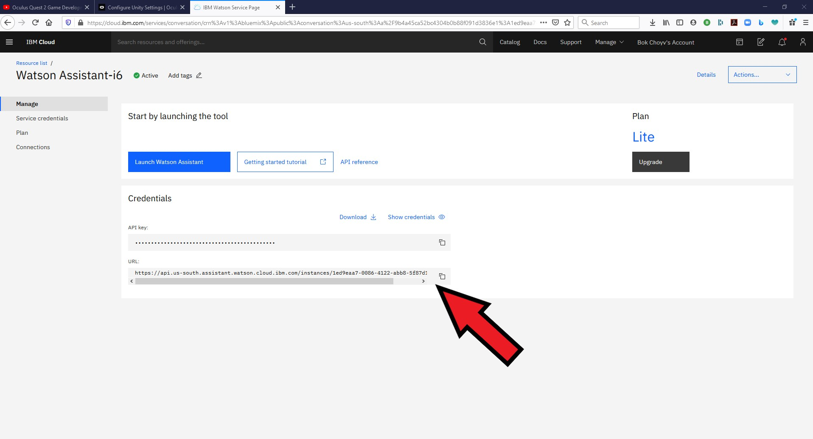
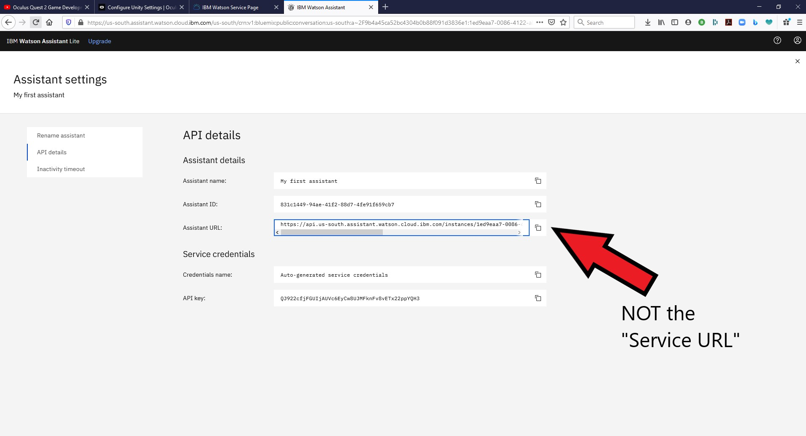
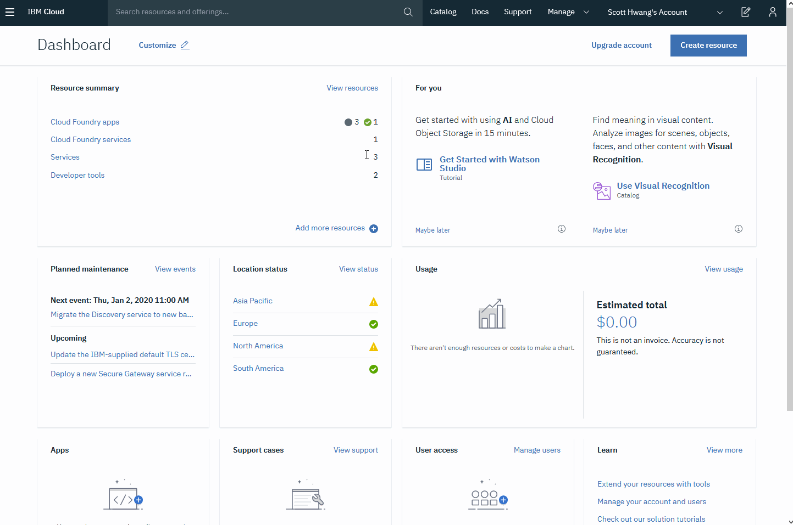

# 3D Chatbot with IBM Watson Speech-To-Text, Assistant, and Text-To-Speech on Unity

Scott Hwang

LinkedIn: https://www.linkedin.com/in/snhwang

11/17/2020

## Latest Notes

11/17/2020

Some people have been trying to use the inccorect Service URL parameter for the Watson Assistant credentials in the Unity project. You should use the Service URL found at the IBM Cloud website on the page when you first open the specific Assistant as shown here:

The URL found on the "Assistant settings" page under "API details" is not correct (for this Unity project) although it is labeled "Assistant URL":

10/11/2020
I created a new YouTube video which just focuses on how to set up the text-to-speech portion of this project: https://youtu.be/Yrtgig6qdhU

07/05/2020
Updated Unity to latest LTS version: 2019.4.3f1. Also, updated to the latest IBM SDKs: unity-sdk-4.7.1 and unity-sdk-core-1.2.1. It seems to work without any other changes.

04/04/2020

It looks like the IBM cloud API documentation has been updated, at least for the portions of interest (text-to-speech, speech-to-text, and Assistant). Other sections are also likely updated. It now has code for multiple languages including C#/Unity that you can just copy with a convenient button and paste into your project. In the near future, I will check the code I obtained from examples contained in their earlier version of the SDK and clean it up where needed. It seems that the latest version for Assistant is now 2020-04-01, so I will also update this. I wish they had this last year! But, I still appreciate it. I was able to reproduce the Watson functionality of this Unity project in a Go project in less than an hour even though I hardly know the languages.

03/30/2020

I have a first draft of a tutorial showing how to incorporate the Unity Multipurpose Avatar (UMA 2) and SALSA lipsync to create a 3D chatbot. I used the text-to-speech services in this project to generate the audio for the tutorial:

https://youtu.be/m39KGVmi0GI

3/28/2020
The Unity project was updated to Unity 2019.3.7f1.

The ibm Unity SDK was updated to the latest version 4.5.0. The Unity SDK core is still at 1.2.0.

I've added a small menu to the Unity Editor call SNH-Watson. This will create a scriptable object named WatsonSetting.asset. This will be the the Assets/Resources folder. All the API keys and other credentials are now placed in this asset. This is more convenient but if you delete it by accident, the link to the prefabs is lost. Just create a new WatsonSettings file with the menu and drag and drop it into the settings slot in each of the prefabs for text-to-speech, speech-to-text, and chat in the inspector.

I've been trying to figure out how to keep API keys safe if an app is distributed. So, I'm turning this into something you can run from a server where all the API keys can be kept away from client apps. So far, I've only made this work for text-to-speech.

Please see Changelog.txt for other Notes.

## Introduction

The code here implements speech-to-text conversion, a conversational chatbot, and text-to-speech conversion using IBM Watson. This is basically an update for the the very helpful tutorial provided as an IBM DeveloperWorks Recipe (https://developer.ibm.com/recipes/tutorials/create-a-3d-digital-human-with-ibm-watson-assistant-and-unity3d/). Following the instructions of the IBM Recipe didn't work for me because some of the components it used had been updated and changed. However, it was still very helpful to know all the software components I needed to create the chatbot. It may have been updated by now.

The code here only includes the audio and text components. As was done in the Recipe, I have used this in conjunction with SALSA LipSync (https://assetstore.unity.com/packages/tools/animation/salsa-lipsync-suite-148442) and a 3D model to create a 3D visual chatbot with moving lips during speech. I also initially used the free UMA 2 Unity Multipurpose Avatar (https://assetstore.unity.com/packages/3d/characters/uma-2-unity-multipurpose-avatar-35611). SALSA LipSync is not a free asset, so I removed it for purposes of posting it to the public. Since the lips weren't moving, it was pointless to have the 3D Avatar, so I removed it too. In addition to UMA 2, I have used this with other 3D models compatible with SALSA, including models from Reallusion and Daz3D.

The following clip shows a demo of one of my earliest working versions using the chatbot with a 3D character model and SALSA LipSync:
  https://www.youtube.com/watch?v=tScSVz7OKJM&feature=youtu.be

## Implementation

The current code is a Unity 2019.3.7f1 project. The V1 and V2 branches were developed with Unity 2019.2.8f1.  

This code uses the most current available versions of the IBM unity-sdk (version 4.5.0, https://github.com/watson-developer-cloud/unity-sdk) and of unity-sdk-core (version 1.2.0, https://github.com/IBM/unity-sdk-core/). However, the code was originally modified from code provided with unity-sdk.4.0.0 and unity-sdk-core-1.0.0.

Since V1, I've tried to clean up the code and make it more modular. There are now 3 main prefabs in the Assets/Prefabs folder: 1) SpeechToText.prefab, 2) TextToSpeech.prefab, and 3) Chat.prefab. Chat is based on IBM Watson Assistant. Each has a primary script: 1) SpeechToText.cs, 2) TextToSpeech.cs, and 3) SimpleBot.cs. I should probably make the naming consistent. I'm thinking of changing Chat to Assistant to match IBM's naming. There is a CommandBot.cs script to since I am making a version that will not only chat with you but will perform commands in reponse to your speech. This was also based on ideas from code on github (https://github.com/IBM/vr-speech-sandbox-cardboard).

SpeechToText.cs is only slightly modified from ExampleStreaming.cs from unity-sdk-4.0.0. The SpeechToText component listens for speech and uses Watson speech-to-text to convert it to text. The only significant change from the original code is  a modification of OnRecognize() to handle the text that was converted from speech.

The scripts for the TextToSpeech and Chat components were also largely adapted from example code from the IBM Unity SDK 4.0.0. SimpleBot.cs was originally modified from ExampleAssistantV2.cs in the SDK. TextToSpeech and Chat was mixed together in one script in my earliest versions by have now been separated into 2 components.

The most recent versions have undergone more changes to make them hopefully easier to link together. Since we are basically interesting in moving text between the 3 components, I have used InputFields as a means of linking them together. InputFields are convenient for entering text and can be used to trigger actions whenever the text changes or when editing is complete. Basically, the output text from one component can be placed into an InputField to trigger the activation of the next component.

Depending on which modules are used, some helper scripts are also needed. For example, for a chatbot that uses all three components we need to make sure the chatbot is not recording audio while the bot is speaking so it doesn't record itself.

## Setting up IBM Watson Services

Unity enables you to add menus directly to the Editor. I create a simple menu named SNH-Watson which you should be able to see in the menu bar at the top of the editor. It just has 2 functions. One menu item will highlight the file WatsonSettings.asset. The API keys and other credentials and identifiers for the Watson services should now all be placed in this asset by setting the values in the Unity inspector. The other menu item will create additional settings assets in the Assets/Resources folder. This might be helpful if you create multiple different bots on Watson. The prefabs have settings slots in the Unity inspector that are set to the WatsonSettings.asset in the Resources folder. It his is deleted, the link with the prefabs will likely be lost. You can use the menu to create a new settings asset and drag it over the corresponding settings slots using the Unity inspector.  

I'll assume you already created your IBM Watson Text-To-Speech, Assistant, and Speech-To-Text services.

Finding your credentials

To find your text-to-speech credentials, let's start at the IBM Cloud Dashboard:

1. Go to the Navigation drop down menu at the upper left in the Dashboard. Click on it to see the menu and click on Resource list.
2. In the Resource list, go down to Services and click on your Text-to-speech service.
3. You should now be at the page showing your credentials. Clicking on the icon towards the right will copy your API key. You don't need to reveal it to copy it. You will also need to copy the Service URL labeled just as "URL."

1. 

The speech-to-text API key and URL can be found in a similar manner.

For the Assistant chatbot, we need additional information. To find the necessary credentials, let's start from the Dashboard again:

1. At the top left, click on the dropdown Navigation menu and go to the Resource List.
2. In Resource List, go down to the Services and click on your Assistant

2b. On the assistant page with the "Launch Watson Assistant" button, you can see your API key and Service Url. Please note that the Service URL is not the same as the Assistant URL that appears with the API detals in step 5. The Assistant URL is a subdirectory of the Service URL. You will need the Service URL.

3. Click on Launch Watson Assistant. You can get the API key on this page but you also need the Assistant ID.
4. Go to the three vertical dots at he right of your Assistant. Click on settings
5.  In Assistant Settings, click on API details. You will see the credentials which can be copied by clicking on the icons on the right. You will need the Assistant ID. The API key is also available on this page. As a reminder, please recall that the Assitant URL is a subdirectory and thus not the same as the Service URL. By the way, the credentials shown in the clip are already deleted.

Once you have your Watson credentials, select WatsonSettings.asset (or other settings asset) in the Project, which should be in the Assets/Resources folder unless you moved it. Cut and paste your credentials into the appropriate slots in the Unity inspector. I apologize for not having a video for this yet.

I don't remember where I found the version date of 2019-05-28. It seems to work and it is what I have been using. The IBM cloud API documentation uses 2019-02-29, which also seems to work. I put in 2019-12-25, which also worked. Watson supposedly finds the most recent version at or before the specified date. It would be better to find the correct version date but I haven't motivated myself to do so since everything works.

### Problems and Things to Figure Out

I still don't know where to find the official version dates.

