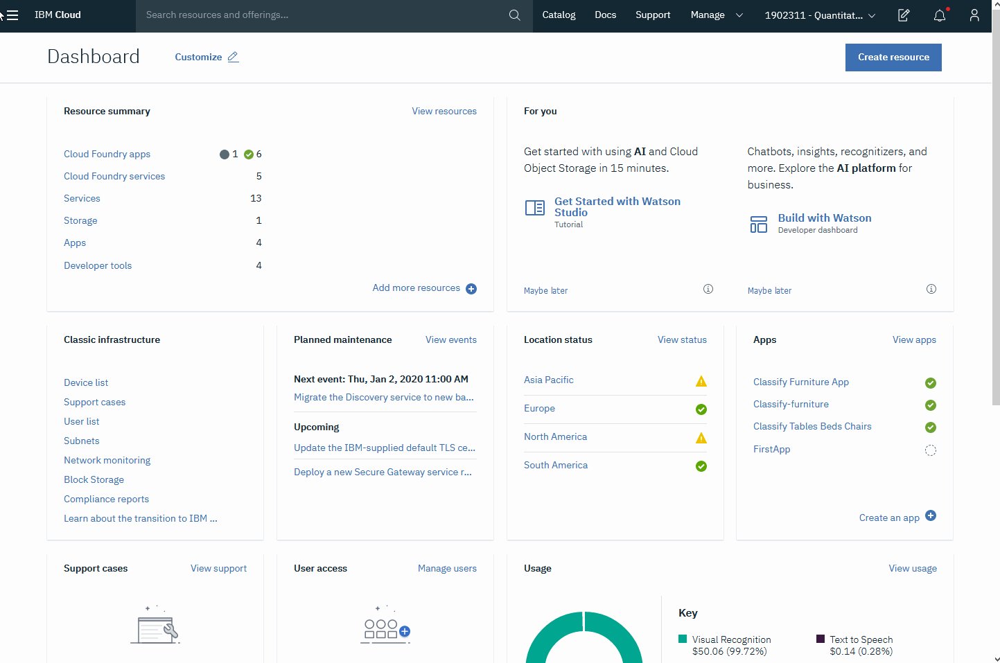
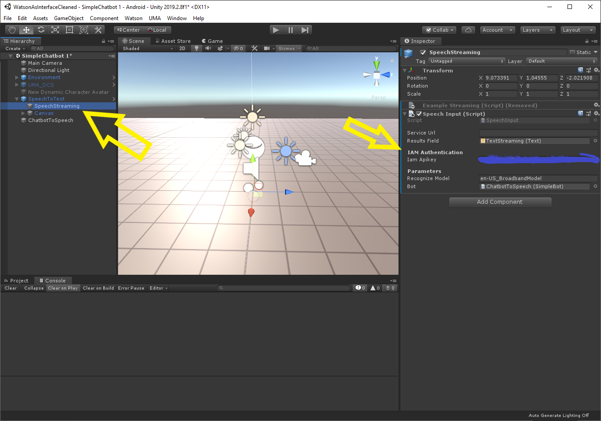
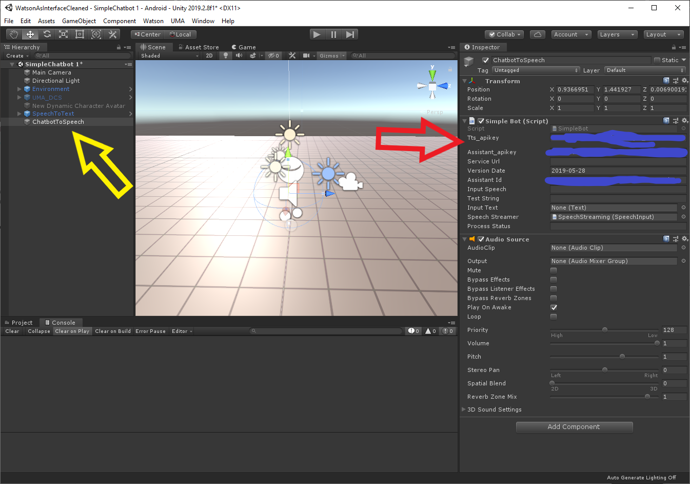

# 3D Chatbot with IBM Watson Speech-To-Text, Assistant, and Text-To-Speech on Unity

Scott Hwang

LinkedIn: https://www.linkedin.com/in/snhwang

03/18/2020

## Notices
I've tried to clean up the code and make it more modular with prefabs for chat, text-to-speech, and speech-to-text. I hope this makes it easier to use. I made use of InputFields to trigger the transfer for text/string data between the modules.

There is now a ChangeLog.txt file where I will keep track of older notices and changes.

The README below needs a lot of updating. It's unchanged since the previous version which is now store in branch v1.

I've started working on a brief tutorial to show how to hook up 3D characters/avatars with Salsa Lipsync to the audio output of text-to-speech.

## Introduction

The code here implements speech-to-text conversion, a conversational chatbot, and text-to-speech conversion using IBM Watson. This is basically an update for the the very helpful tutorial provided as an IBM developerWorks Recipe (https://developer.ibm.com/recipes/tutorials/create-a-3d-digital-human-with-ibm-watson-assistant-and-unity3d/). Following the instructions of the IBM Recipe doesn't work if you use the current versions of all the components. It was still very helpful to know all the software components I needed to create the chatbot. The code here only includes the audio and text components. As was done in the Recipe, I have used this in conjunction with SALSA LipSync (https://assetstore.unity.com/packages/tools/animation/salsa-lipsync-suite-148442) and a 3D model to create a 3D visual chatbot with moving lips during speech. I also initially used the free UMA 2 Unity Multipurpose Avatar (https://assetstore.unity.com/packages/3d/characters/uma-2-unity-multipurpose-avatar-35611). SALSA LipSync is not a free asset, so I removed it for purposes of posting it to the public. Since the lips weren't moving, it was pointless to have the 3D Avatar, so I removed it too. In addition to UMA 2, I have used this with other 3D models compatible with SALSA, including models from Reallusion and Daz3D. I will discuss putting in the 3D model at the end.

The following clip shows a demo using the chatbot with a 3D character model and SALSA LipSync:
  https://www.youtube.com/watch?v=tScSVz7OKJM&feature=youtu.be

## Implementation

I implemented this code using Unity 2019.2.8f1. This is the only version that I know the code works with. I briefly tried to upgrade this to 2019.2.16f1 but it didn't work. It could be a very simple and easily fixed problem but I didn't look into it yet. 

This code works with the most current available version of IBM unity-sdk (version 4.1.1, https://github.com/watson-developer-cloud/unity-sdk) and unity-sdk-core (version 1.2.0, https://github.com/IBM/unity-sdk-core/). However, the code was originally modified from code provided with  unity-sdk.4.0.0 which I was using in conjunction with unity-sdk-core-1.0.0. I have updated the sdk's and the code still works. The folders unity-sdk-4.1.1 and unity-sdk-core-1.0.0 should be in the Assets folder. If you try updating the SDKs in the future, you should delete these folders and replace them with the new ones.

The script SpeechInput.cs is only slightly modified from ExampleStreaming.cs from unity-sdk-4.0.0. ExampleStreaming.cs continuously listens for speech and uses Watson speech-to-text to convert it to text. It will listen until the user stops after completing a phrase or sentence. I modified the function OnRecognize() with a few lines of code such that when the phrase of speech is determined to be finalized, three things occur:

1. Audio recording is made inactive to prevent the bot from recording its own speech.
2. The input text field for the chat bot is set to the text converted from the speech.
3. The processing status of the bot is set to "Process" so that it knows that it should send the text to IBM Watson Assistant to determine a text response 

The script SimpleBot.cs is modified from ExampleAssistantV2.cs which originally providing testing for Unity with IBM Watson Assistant. The tests involved sending text messages to and receiving text responses from Assistant. I added in an IBM Watson text-to-speech service to convert the text to speech as was done in the original Recipe. When the speech is processed the status is set to "Finished" and the audio recording for speech is re-activated.

I also have a version where I incorporated commands to be initated by the chatbot as was done periouvsly at:

https://github.com/IBM/vr-speech-sandbox-cardboard

## Setting up IBM Watson Services

I'll assume you already created your IBM Watson Text-To-Speech, Assistant, and Speech-To-Text services.

Finding your credentials

To find your text-to-speech credentials, let's start at the IBM Cloud Dashboard:

1. Go to the Navigation drop down menu at the upper left in the Dashboard. Click on it to see the menu and click on Resource list.
2. In the Resource list, go down to Services and click on your Text-to-speech service.
3. You should now be at the page showing your credentials. Clicking on the icon towards the right will copy your API key. You don't need to reveal it to copy it. You will also need to copy the Service URL labeled just as "URL."

1. 

The speech-to-text API key and URL can be found in a similar manner.

For the Assistant chatbot, we need additional information. To find the necessary credentials, let's start from the Dashboard again:

1. At the top left, click on the dropdown Navigation menu and go to the Resource List.
2. In Resource List, go down to the Services and click on your Assistant

2b. On the assistant page with the "Launch Watson Assistant" button, you can see your API key and Service Url. Please note that the Service URL is not the same as the Assistant URL that appears with the API detals in step 5. The Assistant URL is a subdirectory of the Service URL. You will need the Service URL.

3. Click on Launch Watson Assistant. You can get the API key on this page but you also need the Assistant ID.
4. Go to the three vertical dots at he right of your Assistant. Click on settings
5.  In Assistant Settings, click on API details. You will see the credentials which can be copied by clicking on the icons on the right. You will need the Assistant ID. The API key is also available on this page. As a reminder, please recall that the Assitant URL is a subdirectory and thus not the same as the Service URL. By the way, the credentials shown in the clip are already deleted.

Where to place the credentials

Find the SpeechStreaming gameobject under the SpeechToText gameobject (arrow on the left). If you select it, you will see the IAM APIkey field in the Inspector on the right where you should paste your Speech-to-text API key (arrow on the right and blocked out by the blue line). Although not shown, you must also paste in your Service URL.

Select the ChatbotToSpeech gameobject to see the fields for the Assistant API key, Service URL, Version Date, Assistant ID, Text-to-speech API key, and Text-to-speech Service URL. These fields should be filled in with the credentials found as described above. Please note that the pic incorrectedly shows the Service URL for Assistant as empty and does not even show the field for the Text-to-speech Service URL. I don't remember where I found the version date as specified by 2019-05-28. It seems to work and it is what I have been using. The IBM cloud API documentation uses 2019-02-29, which also seems to work. I put in 2019-12-25, which also worked. Watson supposedly finds the most recent version at or before the specified date. It would be better to find the correct version date but I haven't motivated myself to do so since everything works.

Problems and Things to Figure Out

I still don't know where to find the official version dates.

I fixed the problem about the code only working for the Dallas Watson region. I have confirmed it works using the Dallas, Washington DC, and London regions.
